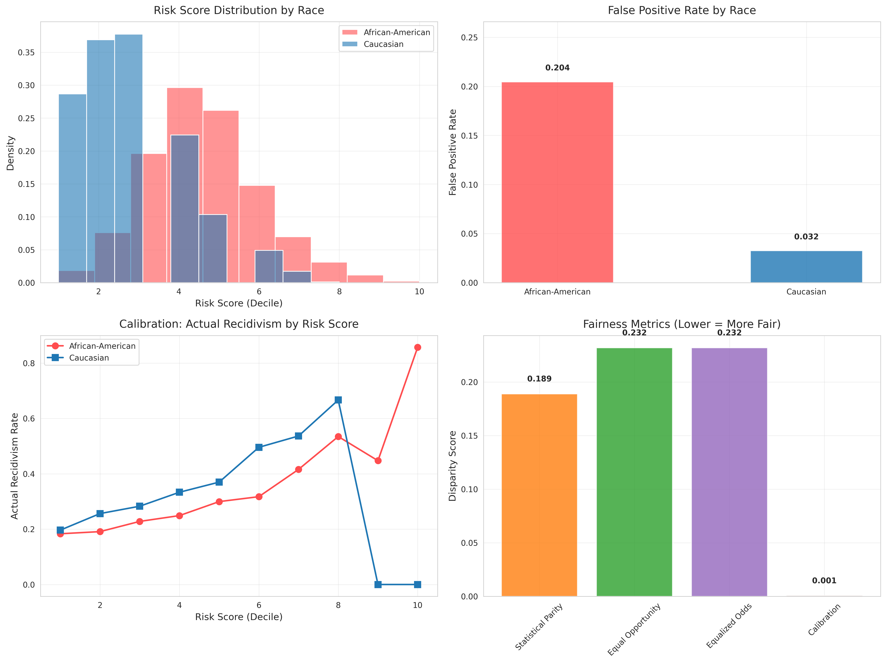

# AI Ethics and Fairness Project

This project explores ethical considerations in artificial intelligence through theory, case studies, practical audits, and personal reflection. The analysis includes fairness auditing using IBM’s AI Fairness 360 toolkit, and a bonus section proposing healthcare AI guidelines.

---

## Part 1: Theoretical Understanding (30%)

**File:** [part1.md](./part1.md)

Covers:
- Definitions and short answers on algorithmic bias, transparency vs explainability, GDPR and AI
- Ethical principle matching exercise

---

## Part 2: Case Study Analysis (40%)

**File:** [part2.md](./part2.md)

Includes:
- Case study on Amazon’s biased hiring algorithm: bias source, fixes, and fairness metrics
- Case study on facial recognition in policing: risks and responsible deployment policies

---

## Part 3: Practical Audit (25%)

**Directory:** [part3/](./part3)

Includes:
- COMPAS Recidivism dataset audit using Python and AIF360  
- Jupyter Notebook with code: [`part3.py`](./part3/part3.py)  
- 300-word report: [`part3_report.md`](./part3/part3_report.md)  
- Visualization of false positive rates:  

---

## Part 4: Ethical Reflection (5%)

**File:** [part4.md](./part4.md)

Contains:
- A personal reflection on applying ethical AI principles to one of your own past or future projects

---

## Bonus Task (Optional +10%)

**File:** [bonus.md](./bonus.md)

Includes:
- A one-page policy proposal for ethical AI in healthcare, covering:
  - Patient consent protocols
  - Bias mitigation strategies
  - Transparency requirements

---

## Project Structure

